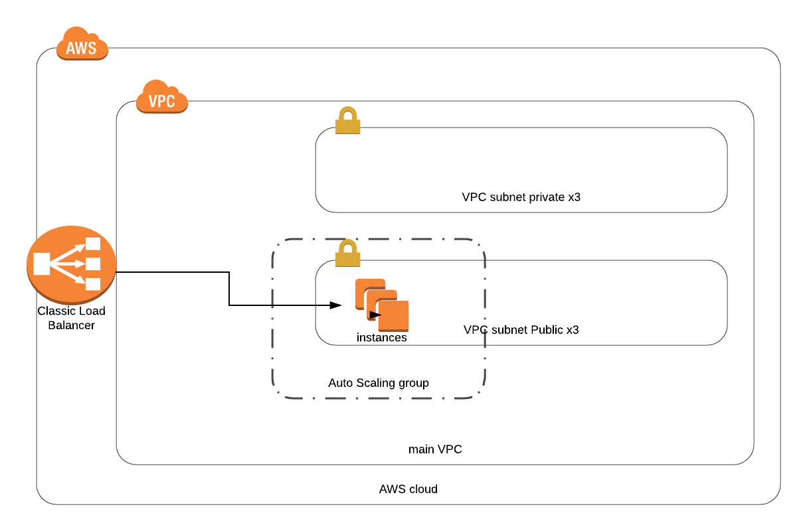

DevOps Coding Test
==================

# Architecture overview

Python app published over multi tier VPC with ELB in front for high availavility  



# Prerequisites

* [Terraform](https://learn.hashicorp.com/terraform/getting-started/install.html)

* [aws CLI](https://docs.aws.amazon.com/cli/latest/userguide/cli-chap-install.html)

# AWS CLI config 

make sure you have your aws creds configured locally 

for more information https://docs.aws.amazon.com/cli/latest/userguide/cli-chap-configure.html 


# GIt clone 

```git clone https://github.com/abelnieva/devops-coding-challenge.git```

# terraform init 
The terraform init command is used to initialize a working directory containing Terraform configuration files. This is the first command that should be run after writing a new Terraform configuration or cloning an existing one from version control. It is safe to run this command multiple times.
```
# terraform plan & apply 

The terraform apply command is used to apply the changes required to reach the desired state of the configuration, or the pre-determined set of actions generated by a terraform plan execution plan.

# Health check URL 
```
python hcheckScript http://url.com
```
use ELB url, you can get that URL from terraform output. 
